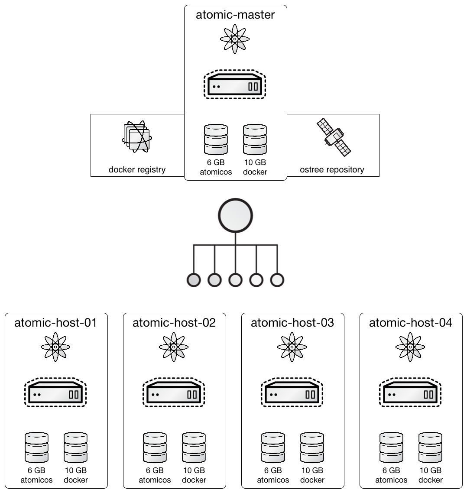

# Atomic Training

<!-- MarkdownTOC depth=4 autolink=true bracket=round -->

- [Overview](#overview)
- [Agenda](#agenda)
  - [Preparation](#preparation)
  - [Class 1: Introduction to Project Atomic](#class-1-introduction-to-project-atomic)
  - [Class 2: Advanced Project Atomic](#class-2-advanced-project-atomic)
- [References](#references)
- [Downloads](#downloads)

<!-- /MarkdownTOC -->

## Overview

When: October 2-3, 2015

Where: Ohio LinuxFest Institute / Columbus, OH

_Please be advised that this training may require Internet access for things such as downloading updates and Docker images._

The purpose of this training to to quickly demonstrate an application-centric IT architecture by providing an end-to-end solution for deploying containerized applications quickly and reliably, with atomic update and rollback for application and host alike.

We're going to be building 5 systems, one master and four hosts.  These directions will produce the following systems:

| hostname       | ip             | roles                                                                    |
|----------------|----------------|--------------------------------------------------------------------------|
| atomic-master  | 192.168.122.10 | etcd & flanneld & kubernetes masters, docker registry, ostree repository |
| atomic-host-01 | 192.168.122.11 | atomic container host                                                    |
| atomic-host-02 | 192.168.122.12 | atomic container host                                                    |
| atomic-host-03 | 192.168.122.13 | atomic container host                                                    |
| atomic-host-04 | 192.168.122.14 | atomic container host                                                    |

## Agenda

### Preparation

Things you should do to prepare for training to maximize your lab time.

1. [Prepare](prepare/README.md)

### Class 1: Introduction to Project Atomic

Learn what it is, who provides it, where it can be installed, how it is managed, and why modern infrastructures need it.  Includes a basic hands on lab to performing tasks such as installation, updating the OS, rolling back / reverting changes, as well as basic navigation and security concepts.

1. [Deploy Atomic Hosts](intro/deployAtomicHosts.md)
1. [Configure Storage](intro/configureStorage.md)
1. [Manage Atomic Hosts](intro/manageAtomicHosts.md)
1. [Service Containers](intro/svcContainers.md)
1. [Super Privileged Containers](intro/spcContainers.md)
1. [Install Tools](intro/installTools.md)

### Class 2: Advanced Project Atomic

Learn to differentiate between Service Containers (Apache, Tomcat, DNS, etc.) and Super Privileged Containers (tools, logging, performance, etc).  Includes a more advanced hands on lab demonstrating how to install, manage and orchestrate containers on the Atomic platform.

1. [Configure Atomic Master](intro/configureAtomicMaster.md)
1. [Configure flanneld](advanced/configureFlanneld.md)
1. [Configure kubernetes](advanced/configureKubernetes.md)
1. [Configure Atomic Hosts](advanced/configureAtomicHosts.md)
1. [Deploy Applications](deployApplications.md)

## References

1. [cloud-init](https://cloudinit.readthedocs.org/en/latest/)
1. [Docker](https://www.docker.io/)
1. [etcd](https://coreos.com/etcd/)
1. [Kubernetes](http://kubernetes.io/)
1. [Project Atomic](http://www.projectatomic.io/)
1. [rpm-ostree](http://www.projectatomic.io/docs/os-updates/)
1. [systemd](http://www.freedesktop.org/wiki/Software/systemd/)

## Downloads

1. [Fedora Atomic](https://getfedora.org/cloud/download/atomic.html)
1. [CentOS Atomic](http://cloud.centos.org/centos/7/atomic/images/)
1. [Red Hat Enterprise Linux Atomic Host](https://www.redhat.com/en/technologies/linux-platforms/enterprise-linux)
