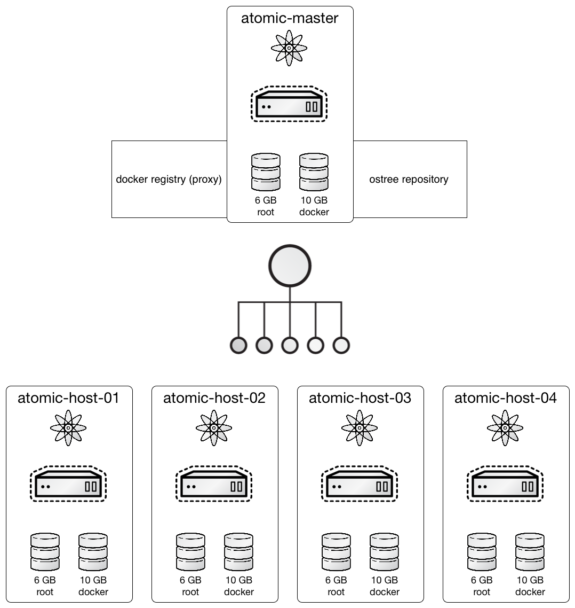

# Project Atomic Training

When: October 2-3, 2015

Where: Ohio LinuxFest Institute / Columbus, OH

_Please be advised that this training may require Internet access for things such as downloading updates and Docker images._

## Overview

The purpose of this training to to quickly demonstrate an application-centric IT architecture by providing an end-to-end solution for deploying containerized applications quickly and reliably, with atomic update and rollback for application and host alike.

We're going to be building 5 systems, one master and four hosts.



### Class 1: Introduction to Project Atomic

Learn what it is, who provides it, where it can be installed, how it is managed, and why modern infrastructures need it.  Includes a basic hands on lab to performing tasks such as installation, updating the OS, rolling back / reverting changes, as well as basic navigation and security concepts.

### Class 2: Advanced Project Atomic

Learn to differentiate between Service Containers (Apache, Tomcat, DNS, etc.) and Super Privileged Containers (tools, logging, performance, etc).  Includes a more advanced hands on lab demonstrating how to install, manage and orchestrate containers on the Atomic platform.

# Before You Arrive

In order to make best use of lab time, please review the deployment options and ensure you have one of the following:

1. A working KVM environment (preferred)
1. A working Virtual Box environment

Before the training begins, please plan on creating the necessary Virtual Machines that will be used for this class as described in this document.  Minimal time will be allocated during the training to complete these steps.

### Notes, Comments and Pointers

* It is assumed that you will be utilizing Fedora Cloud Atomic
* Use sudo and appropriate permissions; insert standard security warnings here
* Correct IPs, hostnames, paths and locations to match your setup
* You will need to change the bridge device and/or adapter to match your setup

## Downloads

We are going to be working with the Fedora Cloud Atomic image, however, this training should work with little to no modification on CentOS Atomic and Red Hat Enterprise Linux Atomic Host.

1. [Fedora Atomic](https://getfedora.org/cloud/download/atomic.html) (preferred)
1. [CentOS Atomic](http://cloud.centos.org/centos/7/atomic/images/)
1. [Red Hat Enterprise Linux Atomic Host](https://www.redhat.com/en/technologies/linux-platforms/enterprise-linux)

The ```cloud-init``` images provided are basic and are not intended for use in a real world environment.  Though not covered in this training, you should choose to [customize the ```cloud-init``` image](http://cloudinit.readthedocs.org/en/latest/topics/examples.html) for instance: adding your own SSH public keys, changing the default password and setting other options as necessary.

## Download Required Softwares

### Grab the ```cloud-init``` images

```
    wget https://people.redhat.com/jpreston/atomic-training/atomic-master-cidata.iso
    wget https://people.redhat.com/jpreston/atomic-training/atomic-host-01-cidata.iso
    wget https://people.redhat.com/jpreston/atomic-training/atomic-host-02-cidata.iso
    wget https://people.redhat.com/jpreston/atomic-training/atomic-host-03-cidata.iso
    wget https://people.redhat.com/jpreston/atomic-training/atomic-host-04-cidata.iso
```

### Grab the Cloud Atomic image

We want to download the appropriate cloud image.

#### Fedora Cloud Atomic (preferred)

```
    wget https://download.fedoraproject.org/pub/fedora/linux/releases/22/Cloud/x86_64/Images/Fedora-Cloud-Atomic-22-20150521.x86_64.qcow2
```

#### CentOS Cloud Atomic

```
    wget http://cloud.centos.org/centos/7/atomic/images/CentOS-Atomic-Host-7.1.2-GenericCloud.qcow2
```

#### Red Hat Enterprise Linux Atomic Host

You'll need an active subscription to download from [access.redhat.com](https://access.redhat.com/downloads/content/271/ver=/rhel---7/7.1.4/x86_64/product-downloads)

## Set the appropriate image

Based on which image you downloaded, we need to set an environment variable of the filename without extension.

```
    # For Fedora-Cloud (preferred)
    A_IMAGE=Fedora-Cloud-Atomic-22-20150521.x86_64

    # For CentOS 7 Atomic
    A_IMAGE=CentOS-Atomic-Host-7.1.2-GenericCloud

    # For RHEL 7 Atomic
    A_IMAGE=rhel-atomic-cloud-7.1-12.x86_64

    export A_IMAGE
```

## Preferred Deployment Option: KVM Environment Setup

### Install the Atomic ```cloud-init``` images

```
      sudo cp atomic-master-cidata.iso /var/lib/libvirt/images/
      sudo cp atomic-host-01-cidata.iso /var/lib/libvirt/images/
      sudo cp atomic-host-02-cidata.iso /var/lib/libvirt/images/
      sudo cp atomic-host-03-cidata.iso /var/lib/libvirt/images/
      sudo cp atomic-host-04-cidata.iso /var/lib/libvirt/images/
```

### Create five copies of the image (one for each host)

```
      sudo cp ${A_IMAGE}.qcow2 /var/lib/libvirt/images/atomic-master.qcow2
      sudo cp ${A_IMAGE}.qcow2 /var/lib/libvirt/images/atomic-host-01.qcow2
      sudo cp ${A_IMAGE}.qcow2 /var/lib/libvirt/images/atomic-host-02.qcow2
      sudo cp ${A_IMAGE}.qcow2 /var/lib/libvirt/images/atomic-host-03.qcow2
      sudo cp ${A_IMAGE}.qcow2 /var/lib/libvirt/images/atomic-host-04.qcow2
```

### Install the images (adjust BRIDGE appropriately)

```
      BRIDGE=virbr0
      LAST_OCTET=10
      for VM in atomic-master atomic-host-01 atomic-host-02 atomic-host-03 atomic-host-04; do
        test -f /var/lib/libvirt/images/${VM}-docker.qcow2 \
          && rm -f /var/lib/libvirt/images/${VM}-docker.qcow2
        chown qemu:qemu /var/lib/libvirt/images/${VM}*
        virt-install --import --name "${VM}" \
          --os-variant fedora21 \
          --ram 1024 --vcpus 2 \
          --disk path=/var/lib/libvirt/images/${VM}.qcow2,format=qcow2,bus=virtio \
          --disk path=/var/lib/libvirt/images/${VM}-docker.qcow2,format=qcow2,bus=virtio,size=10 \
          --disk path=/var/lib/libvirt/images/${VM}-cidata.iso,device=cdrom \
          --network bridge=${BRIDGE} --force \
          --noautoconsole
        A_MAC=$(virsh domiflist ${VM} | tail -n 2 | head -n 1 | awk '{print $5}')
        virsh net-update default add ip-dhcp-host \
          "<host mac='${A_MAC}' name='${VM}' ip='192.168.122.${LAST_OCTET}' />" \
          --live --config
          LAST_OCTET=$((${LAST_OCTET}+1))
      done
```

## Deployment Option: VirtualBox Environment Setup

### Create VM Data Paths

Create paths to separate host data

```
      mkdir atomic-master atomic-host-{01,02,03,04}
```

### Install ISO images

Install the Atomic cloud-init ISO image

```
      mv atomic-master-cidata.iso atomic-master/
      mv atomic-host-01-cidata.iso atomic-host-01/
      mv atomic-host-02-cidata.iso atomic-host-02/
      mv atomic-host-03-cidata.iso atomic-host-03/
      mv atomic-host-04-cidata.iso atomic-host-04/
```

### Convert VM images

Convert the qcow2 image to vdi for VirtualBox usages

```
      qemu-img convert -O vdi \
        ${A_IMAGE}.qcow2 \
        ${A_IMAGE}.vdi
```

### Create Network

Create a NAT network and configure it

```
      VBoxManage natnetwork add --netname "vboxnat0" --network 192.168.122.0/24 --enable --dhcp on
```

### Create VMs

Create five VMs and attach the appropriate images (adjust BRIDGE appropriately)

```
      BRIDGE=en0
      for VM in atomic-master atomic-host-01 atomic-host-02 atomic-host-03 atomic-host-04; do
        # Copy the cloud image to a unique disk image for each host
        cp ${A_IMAGE}.vdi "${VM}/${VM}.vdi"
        # Reset the UUID for the disk image so it doesn't clash
        VBoxManage internalcommands sethduuid "${VM}/${VM}.vdi"
        # Create the VM
        VBoxManage createvm --name "${VM}" \
          --ostype "Fedora_64" \
          --register
        # Add our storage controller
        VBoxManage storagectl "${VM}" \
          --name "SCSI Controller" \
          --add scsi --controller LSILogic
        # Attach our disk image
        VBoxManage storageattach "${VM}" \
          --storagectl "SCSI Controller" \
          --port 0 --device 0 --type hdd \
          --medium "${VM}/${VM}.vdi"
        # Add an IDE controller for the CDROM
        VBoxManage storagectl "${VM}" \
          --name "IDE Controller" \
          --add ide
        # Attach our ISO image to the CDROM
        VBoxManage storageattach "${VM}" \
          --storagectl "IDE Controller" \
          --port 0 --device 0 --type dvddrive \
          --medium "${VM}/${VM}-cidata.iso"
        # Set various options, like memory, boot order, and network type
        VBoxManage modifyvm "${VM}" --ioapic on
        VBoxManage modifyvm "${VM}" --boot1 dvd --boot2 disk --boot3 none --boot4 none
        VBoxManage modifyvm "${VM}" --memory 1024 --vram 128
        VBoxManage modifyvm "${VM}" --nic1 natnetwork --nat-network1 vboxnat0 --bridgeadapter1 ${BRIDGE}
        # Create a storage disk for our docker images
        test -f "${VM}/${VM}-docker-images.vdi" || VBoxManage createhd \
          --filename "${VM}/${VM}-docker-images.vdi" \
          --size 10240
        # Attach our disk for docker images
        VBoxManage storageattach "${VM}" \
          --storagectl "SCSI Controller" \
          --port 1 --device 0 --type hdd \
          --medium "${VM}/${VM}-docker-images.vdi"
      done
```

## Verify the Atomic Hosts

Now you should have five atomic hosts:

* ```atomic-master```
* ```atomic-host-01```
* ```atomic-host-02```
* ```atomic-host-03```
* ```atomic-host-04```

Power them on, validate the host names and make sure you can login using the following credentials:

For Fedora Atomic (preferred):

* Username: ```fedora```
* Password: ```atomic```

For CentOS Atomic:

* Username: ```centos```
* Password: ```atomic```

For RHEL Atomic:

* Username: ```cloud-user```
* Password: ```atomic```

You might also want to record IPs to make your life easier.

Now, wait until the class, you may want to run through some reference materials!

## References

1. [Project Atomic](http://www.projectatomic.io/)
1. [Docker](https://www.docker.io/)
1. [Kubernetes](http://kubernetes.io/)
1. [rpm-ostree](http://www.projectatomic.io/docs/os-updates/)
1. [systemd](http://www.freedesktop.org/wiki/Software/systemd/)
1. [cloud-init](https://cloudinit.readthedocs.org/en/latest/)
